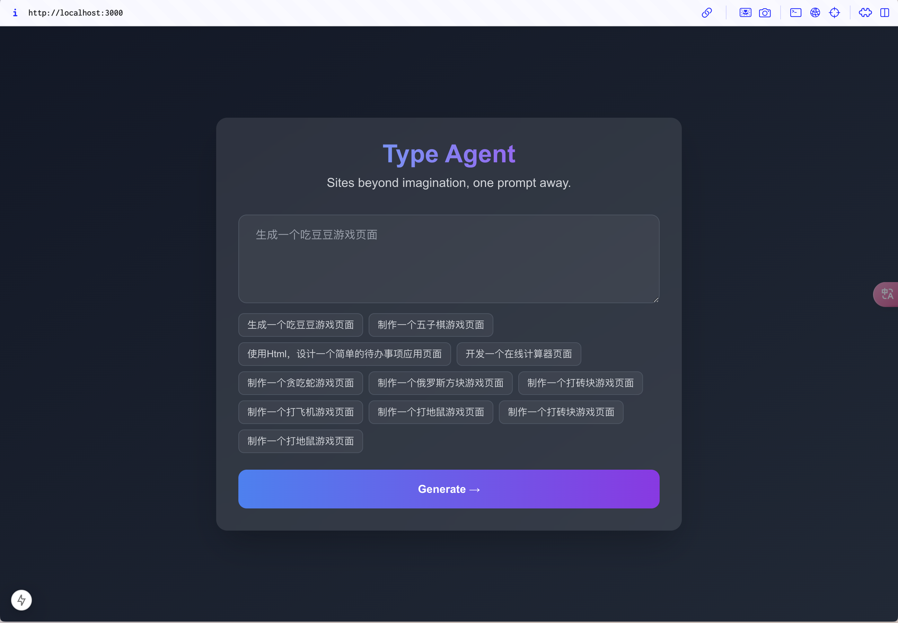
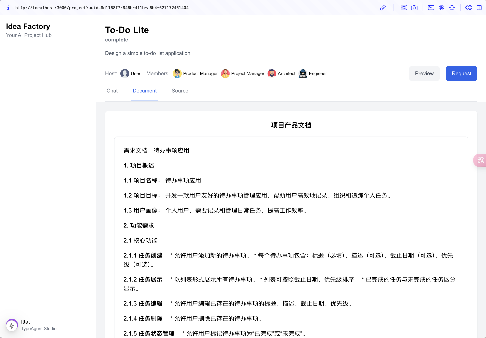
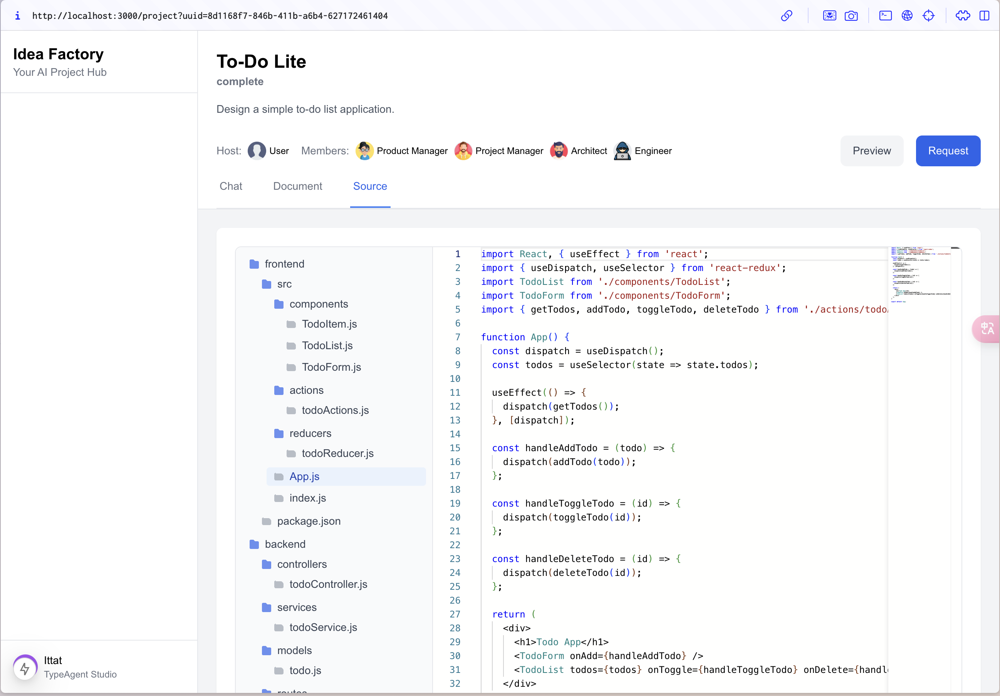
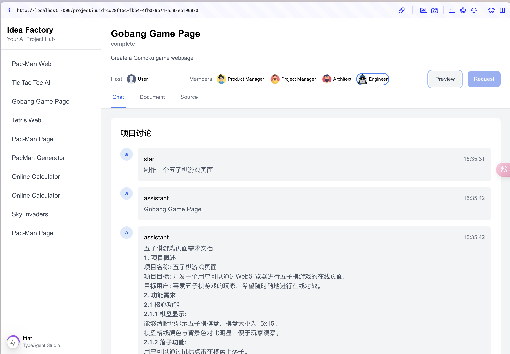
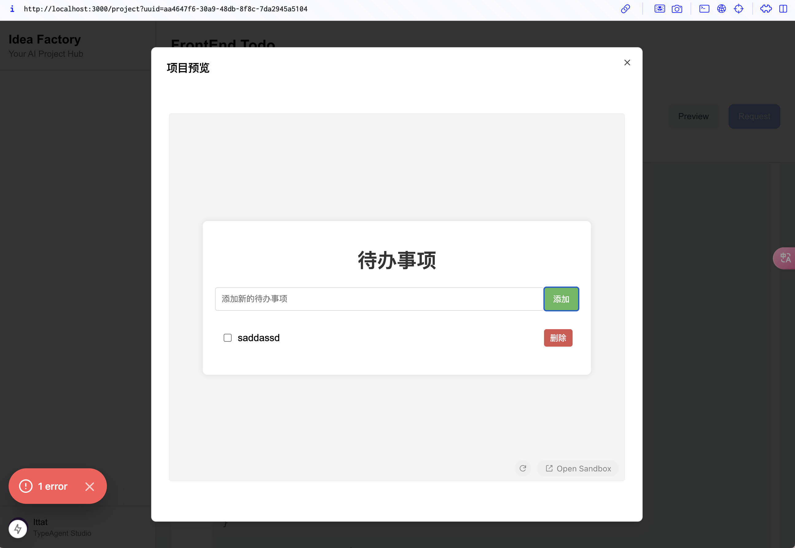
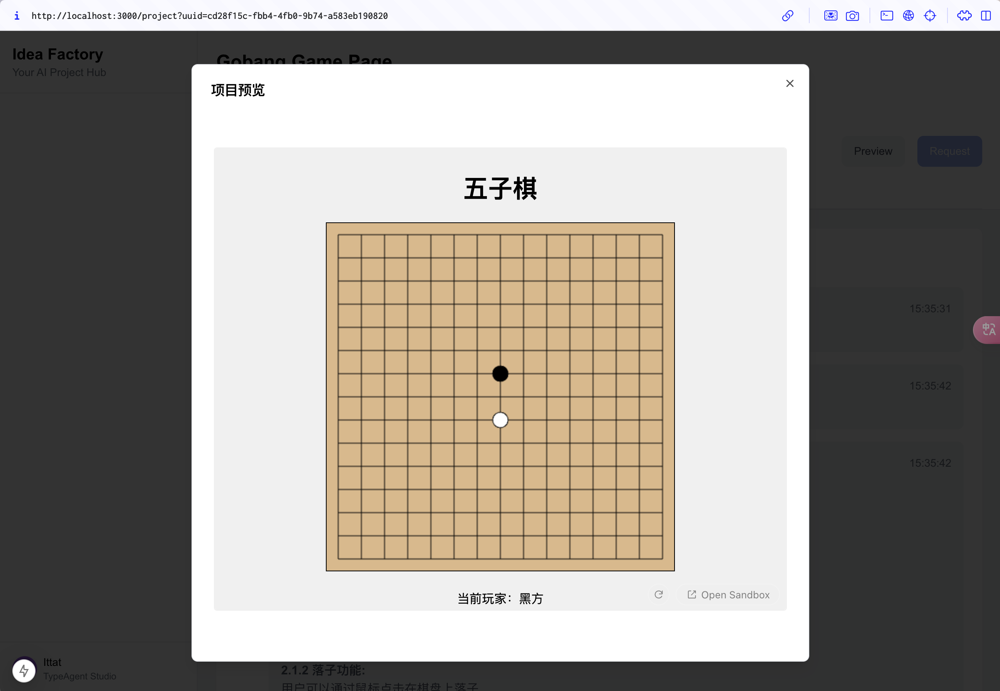
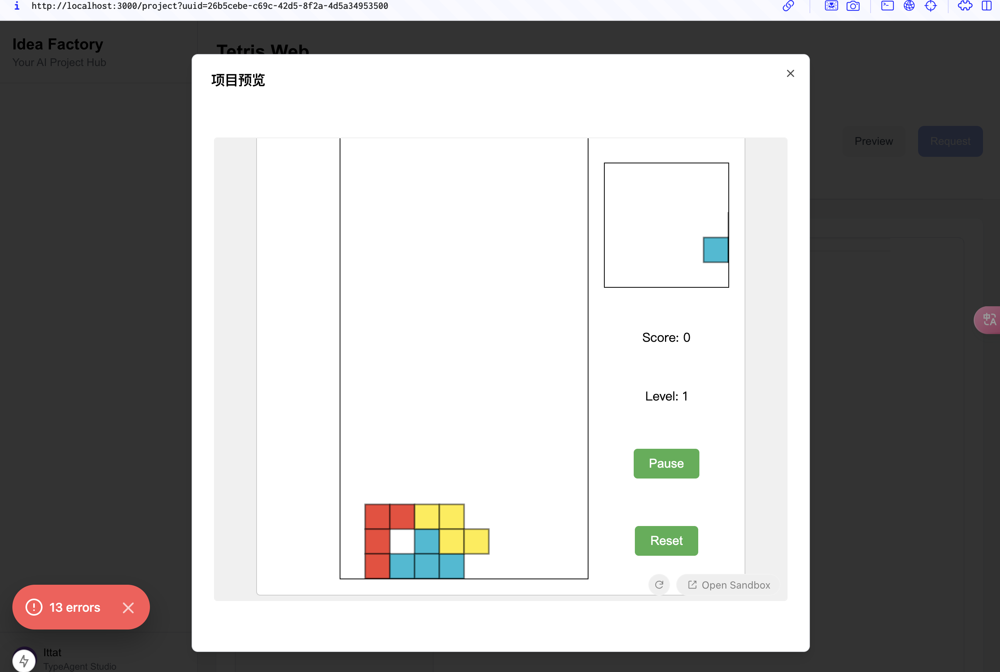
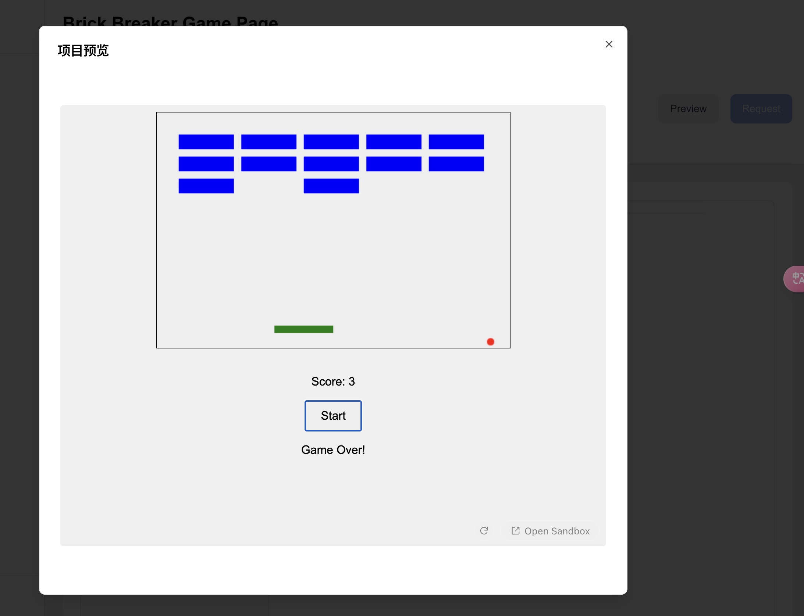
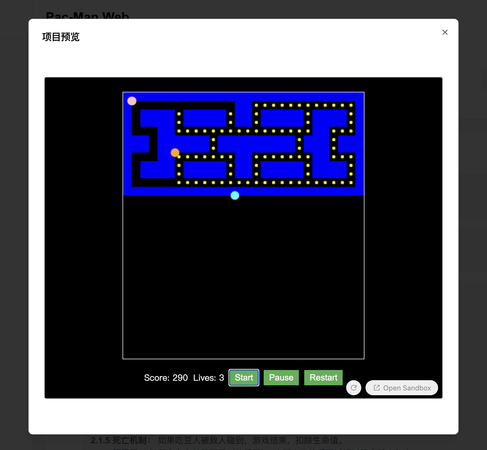
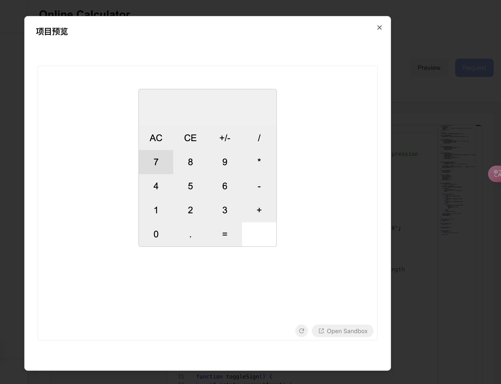

# Type Agent

基于 LLM 的智能开发助手，通过自然语言交互实现需求分析、架构设计和代码生成。

## 主要功能

### 1. 智能对话
- 基于大语言模型的自然语言交互
- 上下文理解和多轮对话支持
- 专业领域知识问答

### 2. 文档管理
- 自动生成产品需求文档
- 技术架构设计文档
- 项目开发计划书

### 3. 代码生成
- 根据需求自动生成代码
- 代码优化和重构建议
- 多语言和框架支持

## 技术架构

### 前端 (NextJS)
- React 18 + TypeScript
- TailwindCSS 样式方案
- 组件化开发

### 后端 (NestJS)
- Node.js + TypeScript
- LangChain 框架集成
- RESTful API 设计

## 效果展示

### 项目操作演示
<video src="images/video.mov" controls></video>
项目的实际操作流程演示，展示了从需求输入到代码生成的完整过程。

### 智能对话与需求分析

通过自然语言交互，系统能够准确理解用户需求，提供专业的技术建议。

### 项目规划与文档生成

自动生成完整的项目规划文档，包括技术架构、开发计划等。


### 代码智能生成

基于需求自动生成高质量代码，支持多种编程语言和框架。

### 多角色协作

支持产品经理、开发者等多角色协作，提高团队效率。

### 实时项目追踪

可视化展示项目进度，实时监控开发状态。

### 支持HTML代码预览








## 快速开始

### 前端启动
```bash
cd chain-agent-nextjs
pnpm install
pnpm dev
```

### 后端启动
```bash
cd chain-agent-nestjs
pnpm install
pnpm start:dev
```


## 技术支持

如有问题或建议，欢迎提交 Issue 或 Pull Request